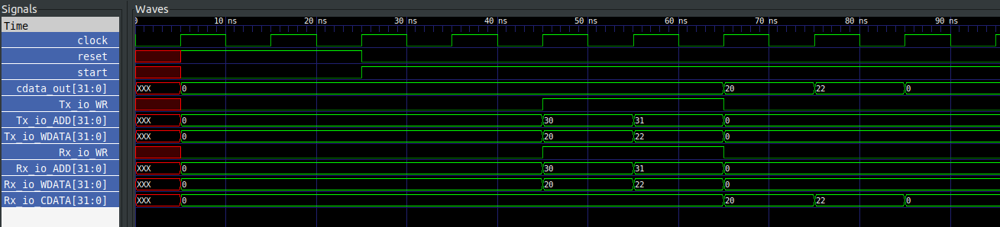
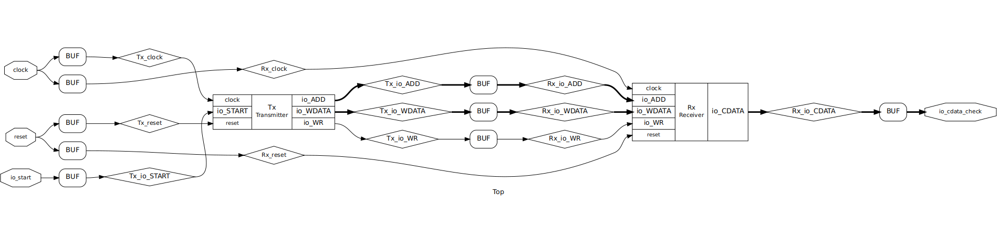

# chisel_FSMs_Communication

## Steps:
```
sbt run            //Compiles the chisel code of two FSMs into verilog file named Top.v
iverilog top_tb.v  //Verilog Testbench for the generated HDL file
./a.out            //Run the Testbench
gtkwave top_dump.vcd //Load the waveforms in gtkwave
```

## Output Waveform:
  <p align="center">
        
  </p>

 # Circuit Level Representation of Top Module:
  <p align="center">
        
  </p>