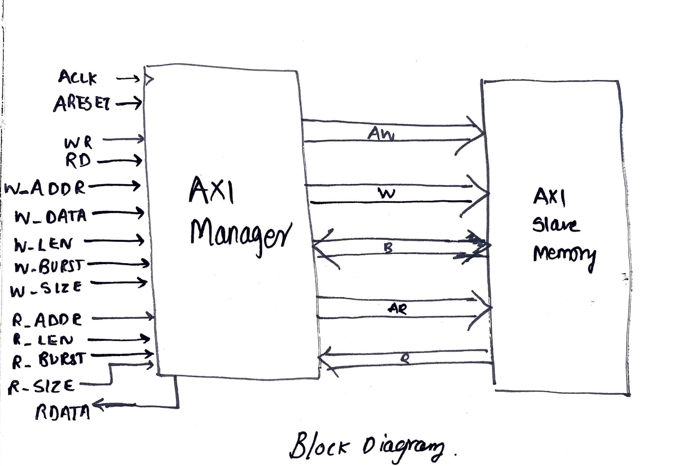
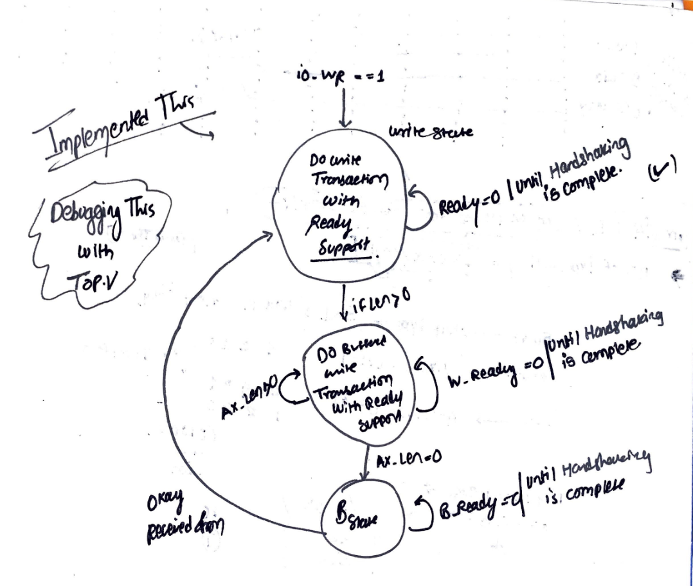
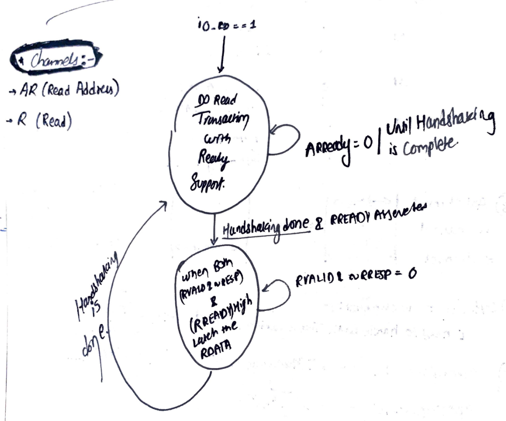
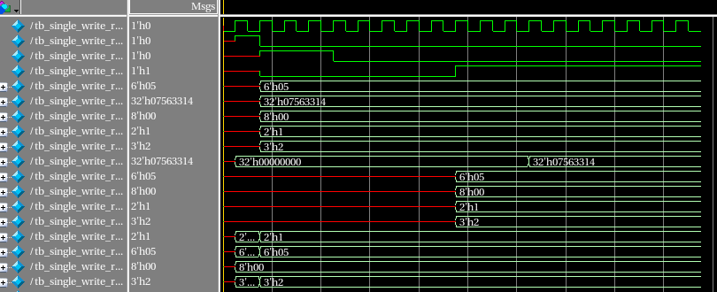
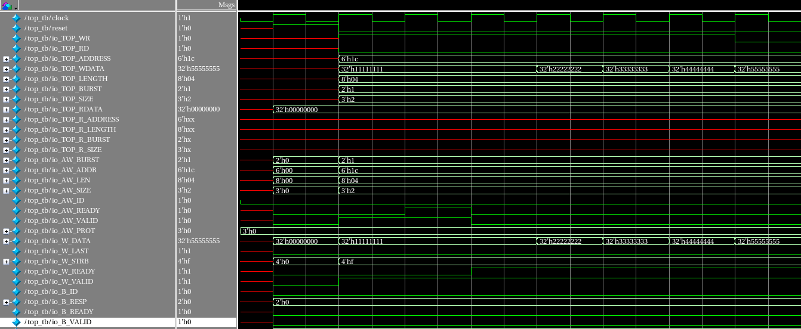
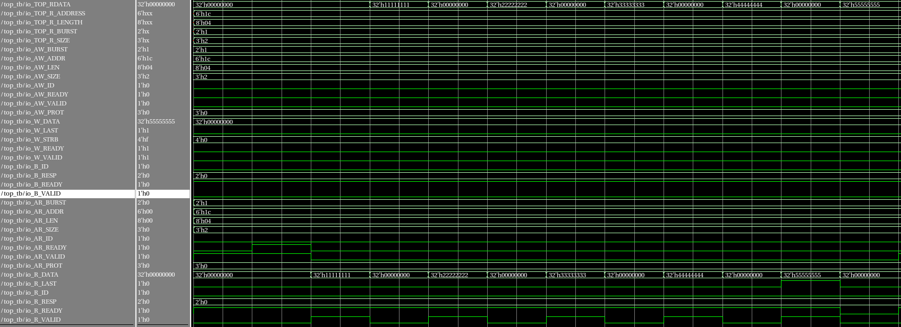

# Communicating with AXI manger to AXI Slave memory.

# AXI Block Diagram:

  

        
  

# AXI Write State Diagram:

  

        
  

# AXI Read State Diagram:

  

        
  

# AXI Single Write-Read Condition:

  

        
  

# AXI Burst Write-Read Condition:

## AXI Burst write on Memory slave:

  

        
  

## AXI Burst Read on Memory slave:

  

        
  
