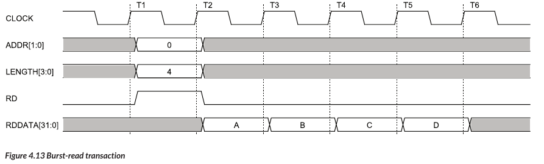

# Interconnect from Scratch in Chisel

- In this project, we have Implemented the Topics coverd in the Chapter 4: Interconnects of the Book [Fundamentals of System-on-Chip Design on Arm Cortex-M Microcontrollers](https://www.arm.com/resources/education/books/fundamentals-soc) by René Beuchat, Florian Depraz, Sahand Kashani, Andrea Guerrieri.
- Chapter 4 of this book covers, how interconnects can be made by scratch. These topics were Implemented in chisel in this project and verification testcases are written in Verilog.

## Project Directory Structure:

``` 
bhilare@LAPPC48:~/omkar/experiments_chisel/example_2/src$ tree -L 5
.
├── main
│   └── scala
│       └── top
│           ├── receiver
│           │   └── receiver.scala
│           ├── top.scala
│           └── transmitter
│               └── transmitter.scala
└── test
    └── scala
        └── top_test
            └── top_test.scala

8 directories, 4 files
```

## Circuit Level Representation of Top Module:
  <p align="center">
        
  </p>

## Final Interconnect Block Diagram:
  <p align="center">
        
  </p>


## Steps:

##  **Normal Write and Read:**

> make TESTBENCH=tb_norma

### Waveform in the Book:

<p align="center">
       
</p>     

### Interconnect Output:

<p align="center">
      
</p>

##  **Burst Read and Write Output**

> make TESTBENCH=tb_burst

### Waveform in the Book:

<p align="center">
       
</p>     

<p align="center">
       
</p> 

### Interconnect Output:

<p align="center">
       
</p> 

##  **Completer to Requestor Ready Write Example**

> make TESTBENCH=tb_ready_write

### Waveform in the Book:

<p align="center">
       
</p>     

### Interconnect Output:

<p align="center">
      
</p>

##  **Completer to Requestor Ready Read Example**

> make TESTBENCH=tb_ready_read

### Waveform in the Book:

<p align="center">
       
</p>     

### Interconnect Output:

<p align="center">
      
</p>
